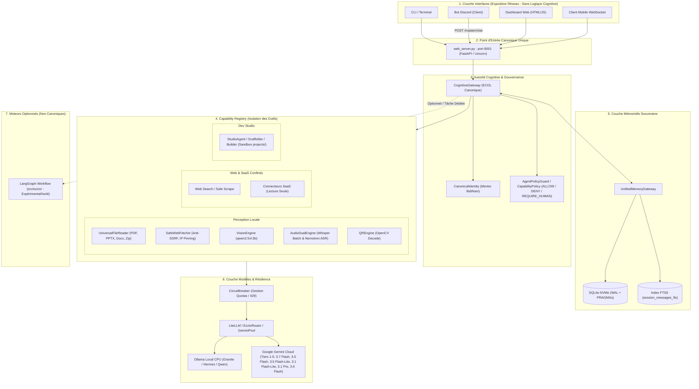

# Architecture Canonique & Spécification Système E-ZzIO

> **Version** : 2.6-Sovereign-Core  
> **Principe Cardinal** : *Fail-Closed, Preuve avant Affirmation, Zéro Complexité Non Justifiée.*

---

## 1. Vue d'Ensemble & Diagramme Architectural

E-ZzIO est une plateforme souveraine locale mono-utilisateur articulée autour d'un **Runtime Unique**, d'un **Registre de Capacités (Capability Registry)** et d'une **Autorité Cognitive Centrale**.

---

## 2. Règles Fondamentales d'Architecture

### Règle 1 — Les Routers sont des Interfaces, pas des Autorités Cognitives
- Les routeurs FastAPI (`routers/master.py`, `routers/memory.py`, `routers/perception.py`, `runtime/routers/mobile.py`) ne prennent **aucune décision cognitive**.
- Ils valident les types d'entrée (schémas Pydantic / DTO), transmettent la requête à l'autorité centrale (`CognitiveGateway` ou `UnifiedMemoryGateway`) et renvoient la réponse standardisée.

### Règle 2 — Hiérarchie d'Autorité : E-ZzIO Runtime vs Moteurs de Workflow
- **E-ZzIO Runtime = L'Autorité**. Il gère la mémoire, les contrats de sécurité, la gouvernance de chemin (`agent_guard.py`), le coffre de secrets (`unified_vault.py`) et la boucle d'auto-réparation (`coding_agent_loop.py`).
- **LangGraph (`src/ezzio/`) = Moteur de workflow optionnel**. Il n'est pas le "cerveau" d'E-ZzIO et reste confiné à son statut expérimental sans pouvoir outrepasser les règles de gouvernance du Runtime.

### Règle 3 — Capability Registry (Registre de Capacités)
Toute capacité ajoutée (locale, web, SaaS, perception) doit respecter les 3 invariants :
1. **Donnée Passive Non Fiable** : Tout flux entrant (PDF, site web, audio, QR code) est étiqueté `[DONNÉE PASSIVE]` et ne peut pas injecter d'instructions système.
2. **Isolation & Confinement** : Les opérations de modification de fichiers sont cloisonnées via `os.path.commonpath` et limitées à `projects/<nom>/` ou à la racine approuvée.
3. **Escalade Humaine Obligatoire (`REQUIRE_HUMAN`)** : Toute altération sur les secrets (`.env`), l'identité (`canonical_identity.py`) ou le guard nécessite une confirmation explicite.

### Règle 4 — Indépendance Absolue du Démarrage Serveur vs Backends Modèles (Ollama OFFLINE)
- **Ollama OFFLINE est un état de capacité (Capability Health), jamais un état du serveur**.
- Aucune indisponibilité de provider ou modèle (Ollama local non lancé, quota cloud dépassé, coupure réseau) ne doit empêcher `web_server.py:8001` de démarrer et de servir ses interfaces (`/`, `/health`, `/metrics`, `/memory`, `/perception`, `/master/chat`).
- Au runtime, si Ollama est `OFFLINE`, la chaîne de décision bascule automatiquement vers le fallback autorisé (`Gemini Cloud`) ou applique le comportement Fail-Closed explicite sans jamais planter le processus serveur.

---

## 3. Séparation /health vs /metrics

- **`/health` (Orchestration & Liveness)** :
  - Doit répondre en `< 5ms`.
  - Retourne l'état synthétique global (`ONLINE`, `DEGRADED`, `OFFLINE`), le PID et le pool de workers.
  - Ne bloque jamais sur l'état externe des providers distants si un backend de secours est opérationnel.
- **`/metrics` (Télémétrie Détaillée & Observabilité)** :
  - Fournit l'état précis de chaque circuit breaker (`gemini`, `ollama`, `groq`), les latences mesurées (p50/p95) et l'usage mémoire.

---

## 4. Politique de Gestion de la Mémoire & Benchmarks Locaux

- **Structure** : Base SQLite avec mode WAL (`PRAGMA journal_mode = WAL`), cache NVMe en mémoire et index virtuel plein texte FTS5.
- **Objectif / Baseline Mesurée** : Les performances de la mémoire doivent être validées par des mesures statistiques réelles (`scripts/bench_memory_fts5.py`) rapportant `p50`, `p95`, `p99`, et non par des promesses théoriques.
