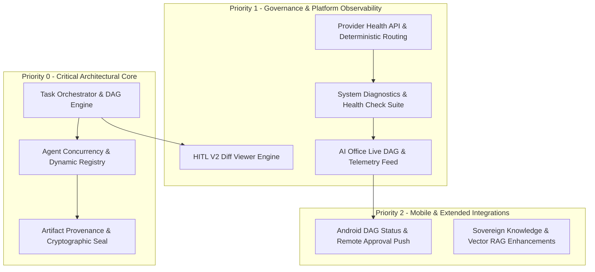

# E-ZZIO V9.2 — COMPREHENSIVE ARCHITECTURE & SUBSYSTEM AUDIT

**Target Version**: V9.2 (Sovereign AI Operating Platform)  
**Golden Baseline**: `ezzio-v9.1-golden` (`e12fe3e24ceafe7192a00fd4f26ae144fa6d96d0`)  
**Active Branch**: `release/v9.2`  
**Audit Timestamp**: 2026-09-04T20:55:00+02:00  
**Methodology**: Forensic, Fail-Closed, Non-Destructive, Zero False-Pass  

---

## 1. Executive Summary & Baseline Validation

E-ZZIO V9.1 achieved complete certification across Frozen Core (3/3), full test suite (111/111 PASS), desktop, web AI Office, and native Android execution on real virtual hardware (`emulator-5554`, API 28). The golden release is cryptographically sealed in commit `e12fe3e` under tag `ezzio-v9.1-golden`.

Evolution to V9.2 elevates E-ZZIO from a **Governed AI Application** into a **Sovereign AI Operating Platform**. This requires closing structural gaps in multi-agent parallelism, task DAG orchestration, artifact provenance tracking, fine-grained provider diagnostics, and HITL differential review, while keeping the 3 Frozen Core components strictly immutable.

---

## 2. Global Subsystem Inventory & Gap Analysis

| Subsystem | Current State (V9.1) | Limitations / Gaps | Evolution Plan (V9.2) | Priority |
| :--- | :--- | :--- | :--- | :---: |
| **Task Orchestration** | Sequential single task transitions (`TaskState`), basic linear runner. | No DAG support, no parent/child task graphs, no concurrency locks. | Implement `core/orchestrator/dag.py` & `engine.py` with dependency graphs and correlation IDs. | **P0** |
| **Agent Concurrency & Registry** | Static list in `routers/office.py`, single active worker pool. | No real-time agent lifecycle (`idle`, `busy`, `waiting_approval`, `degraded`), state races. | Implement `core/agents/registry.py` with thread/coroutine isolation, heartbeats & state machine. | **P0** |
| **Artifact Provenance** | Unstructured files in `runtime/`, no SHA-256 chain to generating tasks. | Impossible to mathematically prove which agent generated an artifact and under what policy. | Implement `core/artifacts/provenance.py` with append-only ledger indexing & SHA-256 sealing. | **P0** |
| **HITL Review (Human-in-the-Loop)** | Approvals with JSON payload inspection & hash check. | No diff-viewer for proposed filesystem/code mutations, manual payload parsing. | Implement `core/governance/diff_viewer.py` and rich unified diff visualization in AI Office. | **P1** |
| **Model Router & Provider Health** | Dynamic fallback in `core/cognitive_router.py`, static JSON catalog. | No live provider health endpoint (`/health`), no latency sweep or deterministic seed modes. | Add `/master/api/v1/providers/health` and deterministic execution profiles to `core/cognitive_router.py`. | **P1** |
| **Observability & Diagnostics** | Basic `/health` endpoint with worker pool status. | No holistic subsystem telemetry, no memory leaks or SQLite WAL status monitor. | Add `GET /master/api/v1/system/diagnostics` and PowerShell diagnostic suite `tools/health_check.ps1`. | **P1** |
| **AI Office & Web Harmonization** | Tailored Tailwind dashboard (`runtime/web/index.html`). | Displays hardcoded mock agents when live DB empty; lacks live DAG visualizer. | Connect live DAG endpoints and Agent Registry events to the Web UI via SSE / WebSocket. | **P1** |
| **Android Client** | Native APK (`ai.ezzio.office`) communicating over WebSocket. | Direct LLM proxy only; lacks task DAG view and approval notifications. | Wire real-time approval requests and task status into mobile contract endpoints. | **P2** |

---

## 3. Priority Matrix (P0 / P1 / P2)

---

## 4. Frozen Core Protection Boundary

The 3 frozen pillars remain untouched:
1. `core/capabilities/capability_policy.py` (`SHA-256: 89A77035...`)
2. `core/capabilities/registry.py` (`SHA-256: 3EE057B3...`)
3. `core/security/audit_ledger.py` (`SHA-256: B26E0D10...`)

All evolutions in V9.2 integrate strictly via extension classes, wrapper satellites, or dedicated packages in `core/orchestrator/`, `core/agents/`, `core/artifacts/`, and `routers/`.

---

## 5. Non-Regression Commitment

- Canonical Test Suite: $\ge 111$ PASS at all times.
- Zero drift against `ezzio-v9.1-golden`.
- `tools/verify_golden_release.ps1` remains functional against the golden baseline.
