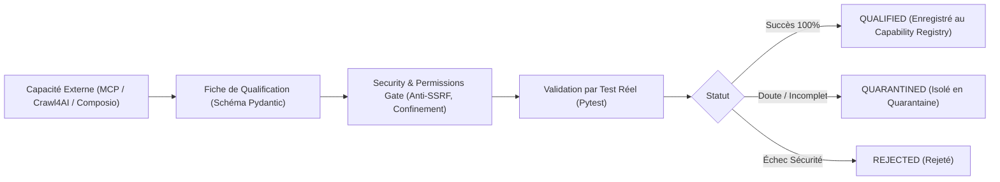

# Processus & Fiche de Qualification des Capacités (Capability Qualification)

> **Règle d'or** : *Aucun outil, plugin ou API externe n'est branché au Runtime E-ZzIO sans une Fiche de Qualification formelle, validée par un test de non-régression.*

---

## 1. Cycle de Qualification



---

## 2. Grille de Qualification Type

Toute future capacité candidate (ex : `web-search-mcp`, `Crawl4AI`, `Composio`, `GLM-5.3`, `Playwright`) doit satisfaire les critères suivants :

```yaml
CAPABILITY QUALIFICATION
────────────────────────────────────────────────────────────────────────────
Name:               web-search-mcp / crawl4ai / composio / etc.
Category:           perception | web | saas | model | browser
Provider:           Nom du composant technique sous-jacent
Input Contract:     Schéma JSON / DTO strict d'entrée
Output Contract:    Schéma JSON de sortie (Étiquetée [DONNÉE PASSIVE BRUTE])
Permissions:        Liste minimale des privilèges requis (Principe du moindre privilège)
Network Access:     true / false (Restreint aux domaines déclarés)
Secrets Required:   Liste des clés demandées (Injectées via key_vault uniquement)
Filesystem Access:  NONE | READ_ONLY_SANDBOX | WRITE_SANDBOX (os.path.commonpath)
Subprocess Access:  false (Strictement interdit sauf pour Dev Studio sandbox)
SSRF Protection:    true (IP Pinning, rejet des IP privées / 127.0.0.1 / AWS metadata)
Timeout:            30.0s max
Max Payload:        50.0 Mo max
Audit Events:       true (Tracé dans le journal d'audit SQLite WAL)
Fail-Closed:        true (Tout comportement inattendu coupe immédiatement l'exécution)
Fallback Behavior:  GRACEFUL_DEGRADE (Retourne un message informatif sans crasher)
Tests:              tests/test_<nom_capacite>.py (Couverture unitaire obligatoire)
Status:             QUALIFIED | QUARANTINED | REJECTED
────────────────────────────────────────────────────────────────────────────
```
