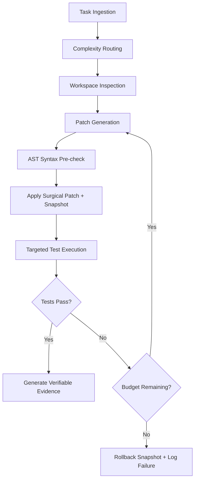

# E-ZZIO Sovereign Autonomous Coding Agent — Technical Architecture & Governance

## 1. Overview
The E-ZZIO Autonomous Coding Agent is an integrated, self-healing software engineer capable of inspecting codebases, applying surgical patches, running bounded test cycles, reviewing syntax and diffs, and logging verifiable evidence.

## 2. Core Architectural Components

### 2.1 Governed Command Executor (`core/agent/command_executor.py`)
- **Strict Allowlist**: Binaries and subcommands strictly restricted (`python`, `pytest`, `ruff`, `git status/diff/log/show`).
- **Destructive Denylist**: Immediate interception and rejection of destructive commands (`git reset --hard`, `git clean -fd`, `rm -rf`, `format`, `shutdown`, `stop-computer`, network egress).
- **Secret Redaction**: Automatic cryptographic/regex masking of credentials (`AIza*`, `gsk_*`, `nvapi-*`, `Bearer *`, private keys) prior to logging.
- **Audit Logging**: Every command execution is timestamped and persisted in `state/audit/governed_commands.jsonl`.

### 2.2 Agent Policy Guard & Change Budget (`core/agent/agent_guard.py`)
- **Confinement**: Uses `os.path.commonpath` to strictly restrict file operations within the workspace root.
- **Kernel Anti-Tampering**: Prohibits modifications to core safety and security files (`agent_guard.py`, `patch_engine.py`, `tools_registry.py`, `command_executor.py`, `evidence_logger.py`, `FROZEN_CORE_MANIFEST.json`, `secrets/.env`).
- **Change Budget (`CodingAgentBudget`)**:
  - `MAX_ITERATIONS`: 10
  - `MAX_FILES`: 5
  - `MAX_DIFF_LINES`: 300
  - `MAX_RUNTIME`: 300 seconds
  - `MAX_COMMANDS`: 20
- **Action Classification**:
  - `SAFE`: read, analyze, search, test execution, git inspect.
  - `SENSITIVE`: source code write, surgical patch application.
  - `CRITICAL`: file deletion, kernel tampering, destructive commands.
- **Automated AST Code Review**: Validates Python syntax using `ast.parse` prior to applying patches to prevent syntax degradation.

### 2.3 Surgical Patch Engine (`core/agent/patch_engine.py`)
- Single-block exact search-and-replace.
- Automated timestamped backup snapshots in `state/snapshots/*.bak`.
- Deterministic rollback mechanism (`rollback()`).

### 2.4 Evidence Logger (`core/agent/evidence_logger.py`)
- Structured forensic trail for each autonomous cycle:
  - `TASK_ID`, `PLAN`, `FILES_CHANGED`, `COMMANDS`, `TESTS`, `RESULT`, `ROLLBACK_STATE`, `FINAL_DIFF`.
- Persisted in dual formats:
  - JSON: `state/evidence/{TASK_ID}_evidence.json`
  - Markdown: `state/evidence/{TASK_ID}_evidence.md`

### 2.5 Complex Task Orchestrator & End-to-End Engine (`core/agent/complex_task_orchestrator.py`)
- **Codebase Impact Analysis (`CodebaseImpactAnalyzer`)**: Automatically discovers affected modules, imports, and related test suites via AST analysis and file heuristics before patching.
- **Ordered DAG Scheduling**: Decomposes complex missions into 6 deterministic phases (`RESEARCH` -> `PLAN` -> `CODE` -> `TEST` -> `REVIEW` -> `VERIFY`).
- **Bounded Auto-Repair Loop**: Automatically diagnoses test failures (assertions, syntax, attributes, imports) and iterates fixes up to `MAX_REPAIR_ITERATIONS = 10`.
- **Integrated Harness API**: Directly accessible via `CodingAgentHarness.run_complex_mission(...)`.

## 3. Autonomous Execution Workflow

## 4. Scope Exclusion
Unreal Engine is strictly out of scope: 0 assets, 0 plugins, 0 interfaces.
