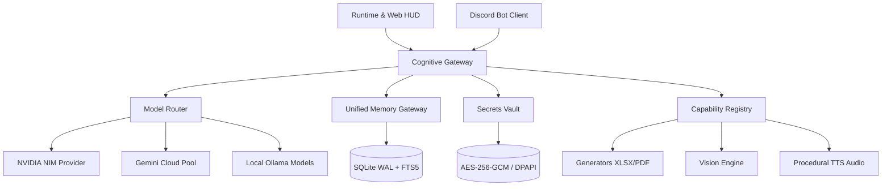

# 🏛️ CARTOGRAPHIE COMPLÈTE DU DÉPÔT E-ZZIO

> **Vision réelle, physique et structurelle de la plateforme E-ZZIO (Lecture Seule).**
> *Date de référence : 31 août 2026*
> *Dépôt cible : `G:/AI/E-zzio`*

---

## 1. VUE D'ENSEMBLE PAR DOMAINES FONCTIONNELS

Le dépôt s'articule autour de 8 grands domaines d'autorité et de support :



---

## 2. DÉTAIL DES DOMAINES D'AUTORITÉ

### 🧠 A. CORE & COGNITION
*Cœur décisionnel, routage souverain des modèles et orchestration cognitive.*
- **[`core/cognition/cognitive_gateway.py`](file:///G:/AI/E-zzio/core/cognition/cognitive_gateway.py)** : Passerelle cognitive souveraine orchestrant le streaming SSE, la synthèse d'identité, la récupération mémoire et l'appel aux providers.
- **[`core/cognition/model_router.py`](file:///G:/AI/E-zzio/core/cognition/model_router.py)** : Moteur de sélection et routage adaptatif des modèles (`phi4-mini`, `qwen3.5:9b`, `hermes3:8b`, NVIDIA NIM, Gemini).
- **[`core/identity/canonical_identity.py`](file:///G:/AI/E-zzio/core/identity/canonical_identity.py)** : Forge d'identité canonique compilant et scellant le persona d'E-ZZIO sans dérive.
- **[`core/sdk.py`](file:///G:/AI/E-zzio/core/sdk.py)** : Interface de programmation SDK unifiée exposant les capacités du Core.
- **[`core/knowledge/codebase_map_reader.py`](file:///G:/AI/E-zzio/core/knowledge/codebase_map_reader.py)** : Lecteur d'auto-connaissance déterministe en lecture seule pour CognitiveGateway.

### 💾 B. MÉMOIRE (UNIFIED MEMORY)
*Autorité unique de persistance épisodique, conversationnelle et forensique.*
- **[`core/memory/unified_gateway.py`](file:///G:/AI/E-zzio/core/memory/unified_gateway.py)** : Unique autorité mémorielle sur SQLite WAL. Gère l'isolation par session, l'historique et la recherche plein-texte FTS5 BM25.
- **[`core/evidence_store.py`](file:///G:/AI/E-zzio/core/evidence_store.py)** : Registre forensique enregistrant les preuves observables et hash d'exécution.

### 🔒 C. SÉCURITÉ & SECRETS (SECRETSVAULT)
*Chiffrement au repos et déchiffrement en mémoire pure.*
- **[`core/security/secrets_vault.py`](file:///G:/AI/E-zzio/core/security/secrets_vault.py)** : Coffre-fort de sécurité chiffré en AES-256-GCM avec scellement DPAPI Windows (`secrets/.env.enc`). Zéro clé sur disque.
- **[`core/security/audit_ledger.py`](file:///G:/AI/E-zzio/core/security/audit_ledger.py)** : Journal d'audit cryptographique non répudiable (chaînage SHA-256 append-only).

### 🌐 D. RUNTIME & INTERFACES
*Serveurs d'application et clients utilisateurs.*
- **[`runtime/external/ezzio_app.py`](file:///G:/AI/E-zzio/runtime/external/ezzio_app.py)** : Serveur FastAPI/Uvicorn principal exposant `/master/chat`, `/master/chat/stream` (SSE), `/metrics`, et servant le Web HUD.
- **[`web_server.py`](file:///G:/AI/E-zzio/web_server.py)** : Point d'entrée de démarrage serveur Web.
- **[`core/integrations/discord/discord_client.py`](file:///G:/AI/E-zzio/core/integrations/discord/discord_client.py)** : Bot Discord V8.0 avec streaming progressif cadencé (1.2s) et 5 slash commands (`/ask`, `/status`, `/generate_sheet`, `/generate_pdf`, `/vision`).
- **[`runtime/web/index.html`](file:///G:/AI/E-zzio/runtime/web/index.html)** : Interface Web HUD Neural tactile temps réel connectée aux flux SSE.

### 📄 E. GÉNÉRATEURS DE DOCUMENTS
*Moteurs de production bureautique déterministes.*
- **[`core/generators/sheet_engine.py`](file:///G:/AI/E-zzio/core/generators/sheet_engine.py)** : Moteur de génération de tableurs Excel XLSX (openpyxl) avec formules et validation de structure XML.
- **[`core/generators/pdf_engine.py`](file:///G:/AI/E-zzio/core/generators/pdf_engine.py)** : Moteur de publication PDF vectoriel officiel (ReportLab Platypus).
- **[`core/generators/doc_engine.py`](file:///G:/AI/E-zzio/core/generators/doc_engine.py)** : Moteur de génération de documents Word DOCX (python-docx).

### 👁️ F. PERCEPTION & MULTIMODALITÉ
*Vision artificielle et synthèse vocale.*
- **[`core/providers/nvidia_nim_provider.py`](file:///G:/AI/E-zzio/core/providers/nvidia_nim_provider.py)** : Connecteur NVIDIA NIM pour la vision multimodale (`meta/llama-3.2-11b-vision-instruct`) et l'inférence rapide.
- **[`core/capabilities/kokoro_tts_adapter.py`](file:///G:/AI/E-zzio/core/capabilities/kokoro_tts_adapter.py)** : Adaptateur audio avec repli procédural ultra-rapide PCM WAV 24kHz (`ezzio-procedural-tts`).

---

## 3. LES 20 MODULES LES PLUS CENTRAUX (GRAPH DEPENDENCY)

| Module / Fichier | Dépendants (Importé par) | Rôle Résumé |
| :--- | :---: | :--- |
| [`core/__init__.py`](file:///G:/AI/E-zzio/core/__init__.py) | **382** fichiers | E-ZZIO Core Package — Unified Entry Points & Sovereign Architecture. |
| [`core/cloud_brain_broker.py`](file:///G:/AI/E-zzio/core/cloud_brain_broker.py) | **20** fichiers | E-ZZIO Cloud Brain Broker — Canonical Cloud Execution Authority with Identity Cache & Streaming. |
| [`tools/fs_tools.py`](file:///G:/AI/E-zzio/tools/fs_tools.py) | **17** fichiers | Expose les fonctions: _log_audit, validate_syntax, list_directory. |
| [`runtime/hardware/__init__.py`](file:///G:/AI/E-zzio/runtime/hardware/__init__.py) | **16** fichiers | Module de configuration, constantes ou initialisation de package. |
| [`core/decision_router.py`](file:///G:/AI/E-zzio/core/decision_router.py) | **15** fichiers | Implemente la classe SearchMode et la logique associee. |
| [`core/secrets.py`](file:///G:/AI/E-zzio/core/secrets.py) | **14** fichiers | E-ZZIO Core — Sovereign Secrets Loader & SecretsVault Bridge. |
| [`runtime/recovery/__init__.py`](file:///G:/AI/E-zzio/runtime/recovery/__init__.py) | **13** fichiers | Module de configuration, constantes ou initialisation de package. |
| [`core/ezzio_master.py`](file:///G:/AI/E-zzio/core/ezzio_master.py) | **12** fichiers | E-ZZIO Master Orchestrator — Routage dynamique Cloud / Local Ollama via CognitiveGateway. |
| [`routers/chat.py`](file:///G:/AI/E-zzio/routers/chat.py) | **12** fichiers | Implemente la classe ChatRequest et la logique associee. |
| [`runtime/tools/tool_schema.py`](file:///G:/AI/E-zzio/runtime/tools/tool_schema.py) | **12** fichiers | Implemente la classe ToolResult et la logique associee. |
| [`core/evidence_store.py`](file:///G:/AI/E-zzio/core/evidence_store.py) | **11** fichiers | Implemente la classe EvidenceStore et la logique associee. |
| [`runtime/memory/__init__.py`](file:///G:/AI/E-zzio/runtime/memory/__init__.py) | **11** fichiers | Module de configuration, constantes ou initialisation de package. |
| [`runtime/policy/engine.py`](file:///G:/AI/E-zzio/runtime/policy/engine.py) | **11** fichiers | Implemente la classe PolicyDecision et la logique associee. |
| [`runtime/recovery/contracts.py`](file:///G:/AI/E-zzio/runtime/recovery/contracts.py) | **10** fichiers | Implemente la classe Severity et la logique associee. |
| [`runtime/agent/loop.py`](file:///G:/AI/E-zzio/runtime/agent/loop.py) | **9** fichiers | Implemente la classe AgentLoop et la logique associee. |
| [`core/human_chat.py`](file:///G:/AI/E-zzio/core/human_chat.py) | **8** fichiers | Expose les fonctions: now, safe_session_name, session_path. |
| [`core/schemas.py`](file:///G:/AI/E-zzio/core/schemas.py) | **8** fichiers | Implemente la classe Prompt et la logique associee. |
| [`runtime/capabilities/registry.py`](file:///G:/AI/E-zzio/runtime/capabilities/registry.py) | **8** fichiers | E-ZZIO V9.2.1 — Capability Registry |
| [`runtime/core/ezzio_core.py`](file:///G:/AI/E-zzio/runtime/core/ezzio_core.py) | **8** fichiers | Implemente la classe EzzioCore et la logique associee. |
| [`runtime/tools/tool_registry.py`](file:///G:/AI/E-zzio/runtime/tools/tool_registry.py) | **8** fichiers | Implemente la classe ToolRegistry et la logique associee. |

---

## 4. CHAÎNE D'EXÉCUTION RÉELLE DEPUIS LE POINT D'ENTRÉE

Depuis `runtime/external/ezzio_app.py` et `web_server.py` :
```text
runtime/external/ezzio_app.py
├── core/cognition/cognitive_gateway.py
│   ├── core/cognition/model_router.py
│   ├── core/memory/unified_gateway.py
│   ├── core/security/secrets_vault.py
│   ├── core/identity/canonical_identity.py
│   ├── core/knowledge/codebase_map_reader.py
│   └── core/capabilities/registry.py
├── core/providers/nvidia_nim_provider.py
└── runtime/web/index.html (Front-end statique)
```